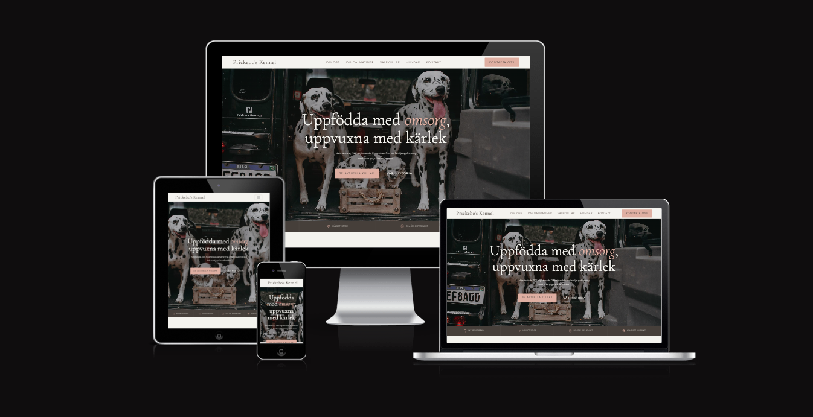

# Prickebo's Kennel



A single-page website for Prickebo's Kennel, a small family-run Dalmatian breeder. The site presents the kennel, the breed, available litters, a photo gallery, and contact information — all in Swedish.

## Tech stack

- Static HTML, no build step
- [Bootstrap 5.3](https://getbootstrap.com/) for layout and components
- Custom styles in [assets/css/styles.css](assets/css/styles.css)
- Google Fonts (Cormorant Garamond, Jost)

## Structure

```
index.html              Page markup and content
assets/css/styles.css   Custom styling on top of Bootstrap
assets/images/          Hero, gallery, litter, and about photos
*.png, *.ico, site.webmanifest   Favicons and PWA manifest
```

## Sections

- **Om oss** – about the kennel
- **Om Dalmatiner** – about the breed
- **Valpkullar** – current/upcoming litters
- **Hundar** – photo gallery
- **Kontakt** – contact details

## Running locally

This is a static site — no dependencies or build process. Open [index.html](index.html) directly in a browser, or serve the folder with any static file server, e.g.:

```bash
python3 -m http.server
```
